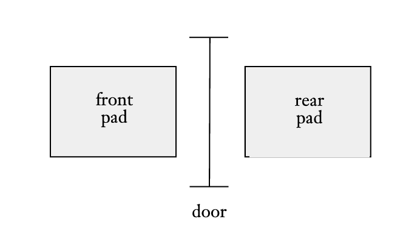
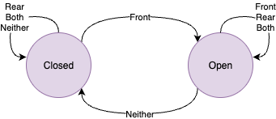
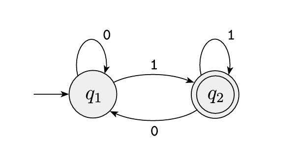

% Finite Automata and Regular Languages
% Alyssa Lytle
% August 21, 2025

<!-- pandoc -t slidy -s notes/01-fa.md -o slides/01-finite-automata.html --webtex -->

# Finite Automata and Regular Languages

## Finite Automaton: An Example

Our example: an automatic door

[^sipser]

Front pad: detect person to walk through

Rear pad: Confirm person has passed through, don't hit other person standing there

## Rules of Operation

|        | Front | Rear | Both | Neither |
| --- | :---: | :---: | :---: | :---: |
| **Closed** | | | | |
| **Open** |  | | | |

## Rules of Operation

|        | Front | Rear | Both | Neither |
| --- | :---: | :---: | :---: | :---: |
| **Closed** | Open | Closed | Closed | Closed |
| **Open** | Open | Open | Open | Closed |

This is called a **state transition table**.

## State Diagram

This is called a state diagram.

## Formal Requirements

A finite automaton should have

- A finite set of states 
- A finite alphabet
- A transition function
- A start state
- A set of accept states

## Formal Definition

A finite automaton can be expressed as 5-tuple $(Q, \Sigma, \delta,q_0, F)$ where:

- $Q$: A finite set of states 
- $\Sigma$: A finite alphabet
- $\delta: Q \times \Sigma \to Q$: A transition function
- $q_0 \in Q$: A start state
- $F \subseteq Q$: A set of accept states

## If We're Being Technical About It...

(Which we are!)

- $Q: \{Open, Closed\}$ 
- $\Sigma: \{Front, Rear, Both, Neither\}$
- $\delta: Q \times \Sigma \to Q: \textrm{Our transition table}$
- $q_0 \in Q: Closed$
- $F \subseteq Q: \{Open, Closed\}$

## The Language of the Machine

For our machine $M$,
The *language* of our machine $L(M)$ is the set of all string inputs that $M$ accepts... 

E.g. $\{\epsilon, Front, FrontRear, FrontRearFront, RearBoth, ...\}$

$M$ accepts or *recognizes* a string if it terminates in an accept state.

(This isn't the best example because this door accepts all input strings, so let's try another one!)

## Another Example

Let $M$ be:

[^sipser]

What are $(Q, \Sigma, \delta,q_0, F)$?

## Another Example

Let $M$ be:

[^sipser]

What is $L(M)$?

## Formal Definition of Computation[^sipser]

Let $M = (Q, \Sigma, \delta,q_0, F)$ 

Let $w = w_1w_2\ldots w_n$ be a string where each $w_i$ is a member of the alphabet $\Sigma$

$M$ accepts $w$ if there exists a sequence of *states* $r_1, r_2, \ldots, r_n$ such that:

1. $r_0 = q_0$
2. $\delta(r_i,w_{i+1})= r_{i+1}$ for $i = 0,\ldots,n-1$, and
3. $r_n \in F$

## A Regular Language

A language is a *regular language* if there exists a finite automaton that recognizes it.

## Language Operations

- Union: $A \cup B = \{x| x\in A \textrm{ or } x \in B\}$ 

- Concatenation: $A \circ B = \{xy| x \in A \textrm{ and } y \in B\}$

- Star: $A^* = \{x_1 x_2 \ldots x_k | k \geq 0 \textrm{ and each } x_i \in A \}$

## Language Operations Example

Let $\Sigma$ be the standard English alphabet

If $A = \{\textrm{good}, \textrm{bad}\}$
$B= \{\textrm{cat}, \textrm{dog}\}$

- $A \cup B$

- $A \circ B$

- $A^*$

## Resources

[^sipser]: Sipser, Michael. "Introduction to the Theory of Computation." ACM Sigact News 27.1 (1996): 27-29.